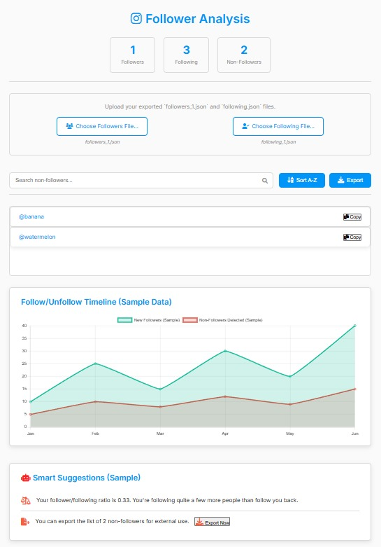

# ✨ Enhanced Instagram Non-Follower Finder ✨

[](https://opensource.org/licenses/MIT)

This tool provides a fast, private, and visually appealing way to discover which Instagram accounts you follow that don't follow you back.

**Built with ❤️ by Pedro Fabian Owono ([@Owono2001](https://github.com/Owono2001))**

---

## 💐 Standing on the Shoulders of Giants! 💐

This project is an enhanced fork, originally created by the talented **Judie Michelle Mosinabre** ([@judiemosinabre](https://github.com/judiemosinabre)). We extend our sincere gratitude for her foundational work! This version aims to build upon that solid base with improved performance, features, and a modern UI.

➡️ *Check out the original repository [here](https://github.com/judiemosinabre/instagram-users-not-following-back).*

---

## 🚀 What's New?

This version significantly improves upon the original concept by:

* **📊 Handling Larger Datasets:** Say goodbye to limitations! Analyzes much larger follower/following lists efficiently (tested well beyond the original 1000+ user benchmark).
* **🎨 Stunning Modern UI:** A completely revamped interface that's clean, intuitive, and responsive.
* **🌓 Light & Dark Theme Toggle:** Choose the look that suits your style with a smooth theme transition.
* **🔍 Instant Search:** Quickly find specific users within the non-follower list.
* **⇅ Flexible Sorting:** Sort the non-follower list alphabetically (A-Z or Z-A).
* **📁 Versatile Export Options:** Export your non-follower list as `TXT`, `CSV`, or `JSON` files.
* **📋 One-Click Copy:** Easily copy usernames (`@username`) to your clipboard.
* **📈 At-a-Glance Stats:** See your total followers, following, and non-follower counts instantly.
* **🔒 100% Client-Side:** Your data stays **private**! All processing happens directly in *your* browser. No data is uploaded or stored anywhere online.

---

## 📸 Visual Preview

See the difference!

<p align="center">
  
  <br><em>Light Theme Interface</em>
</p>

<p align="center">
  
  <br><em>Dark Theme Interface & Export Modal</em>
</p>

---

## 🛠️ Getting Started

Setting up is easy! You just need your Instagram data export.

**Step 1: Download Your Instagram Data**

1.  Open Instagram (web or app).
2.  Go to your **Profile** -> **Settings** (usually a gear icon or menu) -> **Your Activity**.
3.  Select **Download Your Information**.
4.  Tap **Request Download**.
5.  Select your account if prompted.
6.  Choose **Select types of information**.
7.  **Crucially, find and select ONLY "Followers and following"**. Deselect everything else to make the download smaller and faster.
8.  Scroll down. Set the **Format** to **JSON** (***Important!***).
9.  Set **Media quality** to **Low** (not needed for this tool).
10. Set **Date range** to **All time**.
11. Tap **Submit request**.
12. Wait for Instagram to process your request (this can take minutes to hours). You'll receive an email or notification when it's ready.
13. Download the `.zip` file from the link provided.

**Step 2: Prepare the Files**

1.  **Extract** the downloaded `.zip` file.
2.  Navigate inside the extracted folder. Find the `connections` folder, then `followers_and_following`.
3.  You will see these two essential files:
    * `followers_1.json`
    * `following.json`

**Step 3: Use the Tool**

1.  **Download or Clone this Repository:**
    * Click the green **Code** button on this repository page -> **Download ZIP**.
    * Extract the ZIP file.
    * OR: Clone it using Git:
        ```bash
        git clone [https://github.com/Owono2001/instagram-users-not-following-back.git](https://github.com/Owono2001/instagram-users-not-following-back.git)
        ```
2.  **Open the Tool:** Navigate to the downloaded/cloned folder and double-click the `index.html` file. It will open in your default web browser.
3.  **Upload Your Data:**
    * Click the **"Choose Followers File..."** button and select the `followers_1.json` file you located earlier.
    * Click the **"Choose Following File..."** button and select the `following.json` file.
4.  **Analyze:** The tool will automatically process the files and display the list of users who don't follow you back.

---

## ✨ Using the Features

* **Theme Toggle:** Click the **🌙 / ☀️ icon** in the top-right corner.
* **Search:** Type a username in the search bar under "Non-Follower List".
* **Sort:** Click the **"Sort A-Z" / "Sort Z-A"** button to toggle the order.
* **Copy Username:** Click the **"Copy"** button next to any user in the list.
* **Export:**
    1.  Click the **"Export List"** button.
    2.  Choose your desired format (`TXT`, `CSV`, `JSON`) in the modal window.
    3.  Click the **"Confirm Export"** button.

---

## 🤝 Contributing

Contributions are welcome! Feel free to open an **Issue** to report bugs or suggest features, or submit a **Pull Request** with your improvements.

---

## 📜 License

This project is licensed under the MIT License - see the `LICENSE` file for details.

*(**Note:** Please add a `LICENSE` file, e.g., containing the MIT License text, to your repository if you haven't already.)*